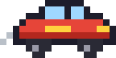
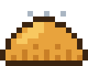
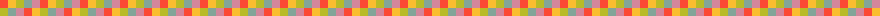

 

&nbsp;&nbsp;&nbsp;&nbsp;&nbsp;&nbsp;

  

## 🕹️ SOBRE MÍ

- 🏎️ Construyo un **vehículo autónomo a escala 1:10** para el **Torneo Mexicano de Robótica 2026** → [Carrito](https://github.com/Empanaditasesina72/Carrito)
- 👾 Me apasionan la **robótica** y la **visión computacional** — OpenCV + YOLOv8 sobre Raspberry Pi 5
- 🧪 Valido todo primero en un **gemelo digital en Unity** antes de tocar el hardware (Sim2Real)
- 🌱 Subiendo de nivel en **desarrollo web** y **Python**
- 🥟 ¿Y el nombre de usuario? Las empanaditas no se cuestionan.

## ⚔️ INVENTARIO

 

## 📊 STATS DEL JUGADOR

  

## 🏆 MISIONES DESTACADAS

## 🐍 LA SERPIENTE SE COME MIS COMMITS

<picture>
  <source media="(prefers-color-scheme: dark)" srcset="https://raw.githubusercontent.com/Empanaditasesina72/Empanaditasesina72/output/github-snake-dark.svg" />
  
</picture>

© 2026 Angel Emmanuel · hecho con ❤️ y muchos píxeles

